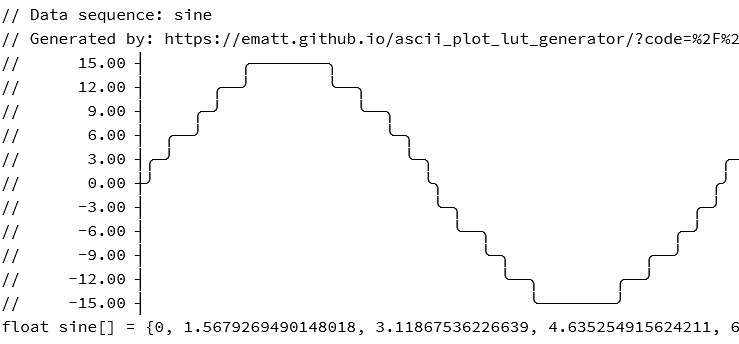

# Foobar

This is a look up table generator with plot in unicode for C.

## Installation

Download the repository and open index.html in any browser or go to [https://ematt.github.io/ascii_plot_lut_generator/](https://ematt.github.io/ascii_plot_lut_generator/)

## Contributing
Pull requests are welcome. For major changes, please open an issue first to discuss what you would like to change.

Please make sure to update tests as appropriate.
